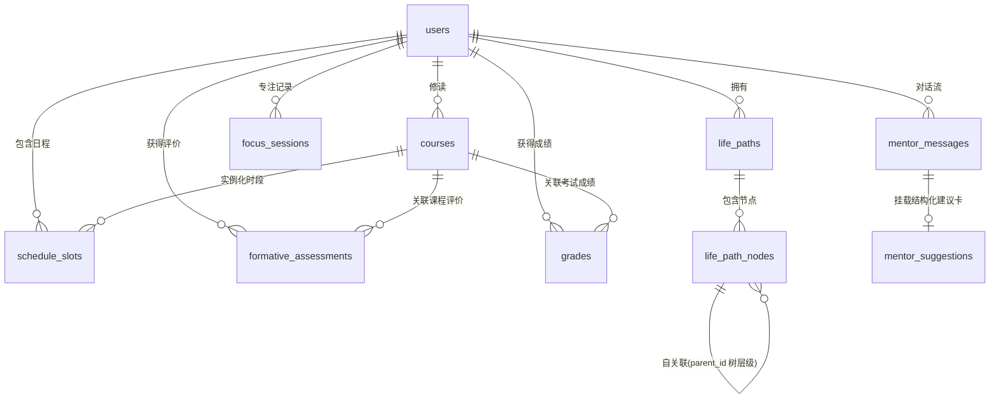

# apps/api · 后端服务架构与数据库设计规范

> 🚀 **十一校园助手（BNDS Campus Companion）核心后端 API 与数据库交付规范**
> 
> 本文档定义了后端服务的**数据持久化架构、数据库表结构（DDL）、核心业务接口契约及产品红线**。前端 iOS 客户端（`apps/ios`）与 Web 端（`apps/web`）已全面按此规范完成交互与数据流对接。

---

## 目录

1. [服务定位与核心职责](#一服务定位与核心职责)
2. [数据库架构设计（ER 图与 9 张核心表）](#二数据库架构设计er-图与-9-张核心表)
3. [可直接执行的 PostgreSQL DDL 脚本](#三可直接执行的-postgresql-ddl-脚本)
4. [核心 API 接口契约清单](#四核心-api-接口契约清单)
5. [后端开发三大硬性红线](#五后端开发三大硬性红线)
6. [推荐技术栈与快速启动建议](#六推荐技术栈与快速启动建议)

---

## 一、服务定位与核心职责

```
┌────────────────────────────────────────────────────────┐
│             iOS Client / Web Client (前端)             │
└──────────────────────────┬─────────────────────────────┘
                           │ HTTP / REST / SSE
┌──────────────────────────▼─────────────────────────────┐
│                       apps/api                         │
│  ┌──────────────────────────────────────────────────┐  │
│  │ 1. 认证与用户档案 (Auth & User Profile)          │  │
│  │ 2. 人生路径树状决策引擎 (LifePath Tree Engine)   │  │
│  │ 3. 课表与云平台数据归一化 (Schedule & Ingest)    │  │
│  │ 4. 过程性评价与成长账本 (Growth & Assessments)   │  │
│  │ 5. 专注模式打卡与统计 (Focus Engine)             │  │
│  │ 6. AI 导师 Agent 编排 (Mentor Dialogue & Cards)  │  │
│  └──────────────────────────────────────────────────┘  │
└──────────────────────────┬─────────────────────────────┘
                           │
┌──────────────────────────▼─────────────────────────────┐
│             PostgreSQL 关系型数据库 (持久化)           │
└────────────────────────────────────────────────────────┘
```

1. **统一数据持久化中心**：为 iOS、Web 端提供统一的 UUID 分配与持久化存储。
2. **外部平台数据接入接管**：承接 `packages/data-ingest` 产出的归一化数据（`CloudRawPayload` / `NormalizedData`），完成 `(user_id, source, external_id)` 的**幂等去重与落库**。
3. **AI 导师编排与建议卡输出**：提供 SSE 流式对话接口，并在回复中产出包含 `“💡 为什么这么建议”` 透明依据的结构化建议卡。

---

## 二、数据库架构设计（ER 图与 9 张核心表）

### 1. 实体关系图（Mermaid ER Diagram）



---

### 2. 表结构详细字典

#### 1) `users`（学生档案表）
存储学生基础信息、云平台绑定标识与兴趣板块。

| 字段名 | 类型 | 约束 | 默认值 | 说明 |
| :--- | :--- | :--- | :--- | :--- |
| `id` | `UUID` | **PK** | `gen_random_uuid()` | 用户全局唯一 ID |
| `name` | `VARCHAR(64)` | NOT NULL | - | 学生姓名（如 "张博宇"） |
| `grade` | `SMALLINT` | NOT NULL | `10` | 年级（如 10, 11, 12） |
| `study_code` | `VARCHAR(32)` | NULL | - | 云平台学号（如 "26111422"） |
| `student_id` | `VARCHAR(64)` | NULL | - | 云平台系统 GUID（如 "c60bf0e8-..."） |
| `school_period_name` | `VARCHAR(64)` | NULL | - | 当前学期（如 "2026-2027学年上学期"） |
| `interests` | `JSONB` | NOT NULL | `'[]'::jsonb` | 兴趣板块标签（如 `["cs", "math", "art"]`） |
| `created_at` | `TIMESTAMPTZ` | NOT NULL | `NOW()` | 注册创建时间 |
| `updated_at` | `TIMESTAMPTZ` | NOT NULL | `NOW()` | 更新时间 |

---

#### 2) `life_paths`（人生路径主表）
学生的人生与学业规划主容器。

| 字段名 | 类型 | 约束 | 默认值 | 说明 |
| :--- | :--- | :--- | :--- | :--- |
| `id` | `UUID` | **PK** | `gen_random_uuid()` | 路径唯一 ID |
| `user_id` | `UUID` | **FK** -> `users(id)` ON DELETE CASCADE | - | 所属用户 |
| `title` | `VARCHAR(128)` | NOT NULL | `'我的高中三年'` | 规划主标题 |
| `status` | `VARCHAR(32)` | NOT NULL | `'active'` | 状态：`active` / `archived` |
| `created_at` | `TIMESTAMPTZ` | NOT NULL | `NOW()` | 创建时间 |
| `updated_at` | `TIMESTAMPTZ` | NOT NULL | `NOW()` | 更新时间 |

---

#### 3) `life_path_nodes`（人生路径节点表 · 核心灵魂）
无限层级树状结构（愿景 -> 长期目标 -> 短期目标 -> 具体任务）。

| 字段名 | 类型 | 约束 | 默认值 | 说明 |
| :--- | :--- | :--- | :--- | :--- |
| `id` | `UUID` | **PK** | `gen_random_uuid()` | 节点唯一 ID |
| `life_path_id` | `UUID` | **FK** -> `life_paths(id)` ON DELETE CASCADE | - | 所属路径 ID |
| `parent_id` | `UUID` | **FK** -> `life_path_nodes(id)` ON DELETE CASCADE | NULL | 父节点 ID（树形结构根节点为 NULL） |
| `type` | `VARCHAR(32)` | NOT NULL | - | 节点层级：`vision` / `long_term_goal` / `short_term_goal` / `task` / `interest` / `note` |
| `title` | `VARCHAR(255)` | NOT NULL | - | 节点标题 |
| `description` | `TEXT` | NOT NULL | `''` | 详细描述 / 规划要点 |
| `status` | `VARCHAR(32)` | NOT NULL | `'in_progress'` | **四态（待定是一等公民）**：`in_progress` / `achieved` / `pending` / `abandoned` |
| `order` | `INT` | NOT NULL | `0` | 同级同类节点排序序号 |
| `source` | `VARCHAR(32)` | NOT NULL | `'user'` | 数据所有权来源：`user` / `ai_suggest` / `cloud_import` / `template` |
| `ai_note` | `TEXT` | NULL | - | 导师批注或建议理由 |
| `start_at` | `TIMESTAMPTZ` | NULL | - | 计划起始时间 |
| `due_at` | `TIMESTAMPTZ` | NULL | - | 目标预期完成截止时间 |
| `completed_at` | `TIMESTAMPTZ` | NULL | - | 实际达成时间（仅 `achieved` 态有效） |
| `created_at` | `TIMESTAMPTZ` | NOT NULL | `NOW()` | 创建时间 |
| `updated_at` | `TIMESTAMPTZ` | NOT NULL | `NOW()` | 更新时间 |

---

#### 4) `courses`（课程库与学期排课）
存储从十一学校云平台/ManageBac抓取的 32 节/周真实课表。

| 字段名 | 类型 | 约束 | 默认值 | 说明 |
| :--- | :--- | :--- | :--- | :--- |
| `id` | `UUID` | **PK** | `gen_random_uuid()` | 课程记录唯一 ID |
| `user_id` | `UUID` | **FK** -> `users(id)` ON DELETE CASCADE | - | 所属用户 |
| `source` | `VARCHAR(32)` | NOT NULL | `'cloud'` | 数据源：`cloud` / `managebac` / `manual` |
| `external_id` | `VARCHAR(128)` | NOT NULL | - | 外部平台唯一 ID（去重键，如 `courseGroupId:whatTime`） |
| `name` | `VARCHAR(128)` | NOT NULL | - | 课程名称（如 "数学Ⅲ-4", "工程-创意万物造-1"） |
| `teacher` | `VARCHAR(64)` | NOT NULL | `'十一名师'` | 授课教师姓名 |
| `room` | `VARCHAR(64)` | NOT NULL | `'未定教室'` | 教室代码（如 "S218A", "容光楼T109"） |
| `day_of_week` | `SMALLINT` | NOT NULL | - | 星期几：`1`=周一 ... `7`=周日 |
| `start_time` | `VARCHAR(8)` | NOT NULL | - | 上课时间（格式 `HH:mm` 如 "08:55"） |
| `end_time` | `VARCHAR(8)` | NOT NULL | - | 下课时间（格式 `HH:mm` 如 "09:40"） |
| `week_parity` | `VARCHAR(16)` | NOT NULL | `'all'` | 单双周：`all` / `odd` / `even` |
| `term` | `VARCHAR(64)` | NOT NULL | - | 学期名称（如 "2026-2027学年上学期"） |
| `category` | `VARCHAR(32)` | NOT NULL | `'required'` | 课程类别：`required` (必修) / `elective` (选修) / `club` (社团) / `self_study` (自习) |
| `created_at` | `TIMESTAMPTZ` | NOT NULL | `NOW()` | 导入时间 |

> 🔑 **唯一约束**：`UNIQUE(user_id, source, external_id)`，用于保证多次同步时**幂等更新（UPSERT）**。

---

#### 5) `schedule_slots`（日程时间轴时段）
用于呈现 Tab 2【今日】每日具体时间轴卡片。

| 字段名 | 类型 | 约束 | 默认值 | 说明 |
| :--- | :--- | :--- | :--- | :--- |
| `id` | `UUID` | **PK** | `gen_random_uuid()` | 时段唯一 ID |
| `user_id` | `UUID` | **FK** -> `users(id)` ON DELETE CASCADE | - | 所属用户 |
| `date` | `DATE` | NOT NULL | - | 具体日期（如 `2026-08-25`） |
| `day_of_week` | `SMALLINT` | NOT NULL | - | 星期几（1~7） |
| `start_at` | `VARCHAR(8)` | NOT NULL | - | 起始时间（`HH:mm`） |
| `end_at` | `VARCHAR(8)` | NOT NULL | - | 结束时间（`HH:mm`） |
| `course_id` | `UUID` | **FK** -> `courses(id)` ON DELETE SET NULL | NULL | 关联课程 ID（可选） |
| `title` | `VARCHAR(128)` | NOT NULL | - | 时段主标题（如课程名或专注任务名） |
| `subtitle` | `VARCHAR(255)` | NULL | - | 副标题（如 "十一学校云平台同步"） |
| `room` | `VARCHAR(64)` | NULL | - | 教室/地点 |
| `kind` | `VARCHAR(32)` | NOT NULL | `'class'` | 类型：`class` (课程) / `study` (研修) / `break` (课间) / `focus` (专注窗口) |
| `source` | `VARCHAR(32)` | NOT NULL | `'cloud'` | 来源：`cloud` / `managebac` / `manual` / `focus` |

---

#### 6) `formative_assessments`（过程性评价表）
存储来自教师的多维度过程性评价。

| 字段名 | 类型 | 约束 | 默认值 | 说明 |
| :--- | :--- | :--- | :--- | :--- |
| `id` | `UUID` | **PK** | `gen_random_uuid()` | 评价唯一 ID |
| `user_id` | `UUID` | **FK** -> `users(id)` ON DELETE CASCADE | - | 所属用户 |
| `course_id` | `UUID` | **FK** -> `courses(id)` ON DELETE SET NULL | NULL | 关联课程 |
| `course_name` | `VARCHAR(128)` | NOT NULL | - | 课程名称 |
| `teacher_name` | `VARCHAR(64)` | NOT NULL | - | 任课教师姓名 |
| `dimension` | `VARCHAR(32)` | NOT NULL | - | 维度：`participation` / `homework` / `quiz` / `project` / `conduct` |
| `grade_level` | `VARCHAR(32)` | NOT NULL | - | 等级：`excellent` (卓越) / `good` (良好) / `pass` (通过) / `needs_improvement` (待改进) |
| `comment` | `TEXT` | NOT NULL | - | 教师评价具体寄语 |
| `source` | `VARCHAR(32)` | NOT NULL | `'cloud'` | 来源：`cloud` / `managebac` |
| `external_id` | `VARCHAR(128)` | NULL | - | 云平台去重 ID |
| `assessed_at` | `TIMESTAMPTZ` | NOT NULL | `NOW()` | 评价下发时间 |

---

#### 7) `grades`（学业成绩表）
各科目阶段性测验与成绩记录。

| 字段名 | 类型 | 约束 | 默认值 | 说明 |
| :--- | :--- | :--- | :--- | :--- |
| `id` | `UUID` | **PK** | `gen_random_uuid()` | 成绩唯一 ID |
| `user_id` | `UUID` | **FK** -> `users(id)` ON DELETE CASCADE | - | 所属用户 |
| `course_id` | `UUID` | **FK** -> `courses(id)` ON DELETE SET NULL | NULL | 关联课程 |
| `course_name` | `VARCHAR(128)` | NOT NULL | - | 课程名 |
| `exam_name` | `VARCHAR(128)` | NOT NULL | - | 考试名称（如 "阶段性检测", "期中大作业"） |
| `score` | `NUMERIC(5, 2)` | NOT NULL | - | 得分（如 98.0） |
| `max_score` | `NUMERIC(5, 2)` | NOT NULL | `100.0` | 满分（如 100.0） |
| `weight` | `NUMERIC(3, 2)` | NOT NULL | `1.0` | 权重（默认 1.0） |
| `exam_date` | `VARCHAR(16)` | NOT NULL | - | 考试日期（如 "2026-10-15"） |
| `source` | `VARCHAR(32)` | NOT NULL | `'cloud'` | 来源：`cloud` / `managebac` / `manual` |
| `external_id` | `VARCHAR(128)` | NULL | - | 外部去重 ID |

---

#### 8) `focus_sessions`（专注打卡记录表）
记录 iOS 端全屏专注倒计时打卡记录，用于在成长账本中聚合统计。

| 字段名 | 类型 | 约束 | 默认值 | 说明 |
| :--- | :--- | :--- | :--- | :--- |
| `id` | `UUID` | **PK** | `gen_random_uuid()` | 专注会话唯一 ID |
| `user_id` | `UUID` | **FK** -> `users(id)` ON DELETE CASCADE | - | 所属用户 |
| `goal_title` | `VARCHAR(255)` | NOT NULL | - | 专注关联目标（如 "数学作业与曲线探究"） |
| `planned_duration_min` | `INT` | NOT NULL | `25` | 计划时长（分钟） |
| `actual_duration_min` | `INT` | NOT NULL | `0` | 实际专注时长（分钟） |
| `status` | `VARCHAR(32)` | NOT NULL | `'completed'` | 状态：`in_progress` / `completed` / `interrupted` |
| `reflection_note` | `TEXT` | NULL | - | 学生打卡反思心得 |
| `started_at` | `TIMESTAMPTZ` | NOT NULL | `NOW()` | 开始时间 |
| `ended_at` | `TIMESTAMPTZ` | NOT NULL | `NOW()` | 结束时间 |

---

#### 9) `mentor_messages` 与 `mentor_suggestions`（AI 导师对话与建议卡）

**`mentor_messages`**（对话消息流）：
| 字段名 | 类型 | 约束 | 默认值 | 说明 |
| :--- | :--- | :--- | :--- | :--- |
| `id` | `UUID` | **PK** | `gen_random_uuid()` | 消息唯一 ID |
| `user_id` | `UUID` | **FK** -> `users(id)` ON DELETE CASCADE | - | 所属用户 |
| `sender` | `VARCHAR(16)` | NOT NULL | - | 发送者：`user` / `mentor` |
| `content` | `TEXT` | NOT NULL | - | 对话正文 Markdown |
| `related_context_tag` | `VARCHAR(128)` | NULL | - | 关联上下文（如 "周五工程课表规划"） |
| `created_at` | `TIMESTAMPTZ` | NOT NULL | `NOW()` | 发送时间 |

**`mentor_suggestions`**（建议卡实体）：
| 字段名 | 类型 | 约束 | 默认值 | 说明 |
| :--- | :--- | :--- | :--- | :--- |
| `id` | `UUID` | **PK** | `gen_random_uuid()` | 建议卡唯一 ID |
| `message_id` | `UUID` | **FK** -> `mentor_messages(id)` ON DELETE CASCADE | - | 挂载的消息 ID |
| `title` | `VARCHAR(255)` | NOT NULL | - | 建议卡主标题 |
| `text` | `TEXT` | NOT NULL | - | 建议具体措施与方案 |
| `reason` | `TEXT` | NOT NULL | - | **“💡 为什么这么建议”** 推导依据（透明溯源） |
| `target_node_type` | `VARCHAR(32)` | NULL | `'task'` | 推荐落地的目标层级 |
| `proposed_node_title` | `VARCHAR(255)` | NULL | - | 预填节点标题 |
| `proposed_node_description`| `TEXT` | NULL | - | 预填节点描述 |
| `status` | `VARCHAR(32)` | NOT NULL | `'pending_review'` | 决策状态：`pending_review` / `accepted` / `postponed` / `rejected` |

---

## 三、可直接执行的 PostgreSQL DDL 脚本

```sql
-- ============================================================
-- 十一校园助手 (BNDS Campus Companion) · 统一数据库初始化脚本
-- ============================================================

CREATE EXTENSION IF NOT EXISTS "uuid-ossp";

-- 1. 用户表
CREATE TABLE users (
    id UUID PRIMARY KEY DEFAULT gen_random_uuid(),
    name VARCHAR(64) NOT NULL,
    grade SMALLINT NOT NULL DEFAULT 10,
    study_code VARCHAR(32),
    student_id VARCHAR(64),
    school_period_name VARCHAR(64),
    interests JSONB NOT NULL DEFAULT '[]'::jsonb,
    created_at TIMESTAMPTZ NOT NULL DEFAULT NOW(),
    updated_at TIMESTAMPTZ NOT NULL DEFAULT NOW()
);

-- 2. 人生路径主表
CREATE TABLE life_paths (
    id UUID PRIMARY KEY DEFAULT gen_random_uuid(),
    user_id UUID NOT NULL REFERENCES users(id) ON DELETE CASCADE,
    title VARCHAR(128) NOT NULL DEFAULT '我的高中三年',
    status VARCHAR(32) NOT NULL DEFAULT 'active',
    created_at TIMESTAMPTZ NOT NULL DEFAULT NOW(),
    updated_at TIMESTAMPTZ NOT NULL DEFAULT NOW()
);

-- 3. 人生路径节点表 (树状自关联)
CREATE TABLE life_path_nodes (
    id UUID PRIMARY KEY DEFAULT gen_random_uuid(),
    life_path_id UUID NOT NULL REFERENCES life_paths(id) ON DELETE CASCADE,
    parent_id UUID REFERENCES life_path_nodes(id) ON DELETE CASCADE,
    type VARCHAR(32) NOT NULL,
    title VARCHAR(255) NOT NULL,
    description TEXT NOT NULL DEFAULT '',
    status VARCHAR(32) NOT NULL DEFAULT 'in_progress',
    "order" INT NOT NULL DEFAULT 0,
    source VARCHAR(32) NOT NULL DEFAULT 'user',
    ai_note TEXT,
    start_at TIMESTAMPTZ,
    due_at TIMESTAMPTZ,
    completed_at TIMESTAMPTZ,
    created_at TIMESTAMPTZ NOT NULL DEFAULT NOW(),
    updated_at TIMESTAMPTZ NOT NULL DEFAULT NOW()
);
CREATE INDEX idx_nodes_path_parent ON life_path_nodes(life_path_id, parent_id);
CREATE INDEX idx_nodes_status ON life_path_nodes(status);

-- 4. 课程表 (云平台/ManageBac 同步)
CREATE TABLE courses (
    id UUID PRIMARY KEY DEFAULT gen_random_uuid(),
    user_id UUID NOT NULL REFERENCES users(id) ON DELETE CASCADE,
    source VARCHAR(32) NOT NULL DEFAULT 'cloud',
    external_id VARCHAR(128) NOT NULL,
    name VARCHAR(128) NOT NULL,
    teacher VARCHAR(64) NOT NULL DEFAULT '十一名师',
    room VARCHAR(64) NOT NULL DEFAULT '未定教室',
    day_of_week SMALLINT NOT NULL CHECK (day_of_week BETWEEN 1 AND 7),
    start_time VARCHAR(8) NOT NULL,
    end_time VARCHAR(8) NOT NULL,
    week_parity VARCHAR(16) NOT NULL DEFAULT 'all',
    term VARCHAR(64) NOT NULL,
    category VARCHAR(32) NOT NULL DEFAULT 'required',
    created_at TIMESTAMPTZ NOT NULL DEFAULT NOW(),
    CONSTRAINT uq_course_external UNIQUE (user_id, source, external_id)
);
CREATE INDEX idx_courses_dow ON courses(user_id, day_of_week);

-- 5. 日程时段表
CREATE TABLE schedule_slots (
    id UUID PRIMARY KEY DEFAULT gen_random_uuid(),
    user_id UUID NOT NULL REFERENCES users(id) ON DELETE CASCADE,
    date DATE NOT NULL,
    day_of_week SMALLINT NOT NULL CHECK (day_of_week BETWEEN 1 AND 7),
    start_at VARCHAR(8) NOT NULL,
    end_at VARCHAR(8) NOT NULL,
    course_id UUID REFERENCES courses(id) ON DELETE SET NULL,
    title VARCHAR(128) NOT NULL,
    subtitle VARCHAR(255),
    room VARCHAR(64),
    kind VARCHAR(32) NOT NULL DEFAULT 'class',
    source VARCHAR(32) NOT NULL DEFAULT 'cloud'
);
CREATE INDEX idx_slots_user_date ON schedule_slots(user_id, date, day_of_week);

-- 6. 过程性评价表
CREATE TABLE formative_assessments (
    id UUID PRIMARY KEY DEFAULT gen_random_uuid(),
    user_id UUID NOT NULL REFERENCES users(id) ON DELETE CASCADE,
    course_id UUID REFERENCES courses(id) ON DELETE SET NULL,
    course_name VARCHAR(128) NOT NULL,
    teacher_name VARCHAR(64) NOT NULL,
    dimension VARCHAR(32) NOT NULL,
    grade_level VARCHAR(32) NOT NULL,
    comment TEXT NOT NULL,
    source VARCHAR(32) NOT NULL DEFAULT 'cloud',
    external_id VARCHAR(128),
    assessed_at TIMESTAMPTZ NOT NULL DEFAULT NOW()
);

-- 7. 学业成绩表
CREATE TABLE grades (
    id UUID PRIMARY KEY DEFAULT gen_random_uuid(),
    user_id UUID NOT NULL REFERENCES users(id) ON DELETE CASCADE,
    course_id UUID REFERENCES courses(id) ON DELETE SET NULL,
    course_name VARCHAR(128) NOT NULL,
    exam_name VARCHAR(128) NOT NULL,
    score NUMERIC(5, 2) NOT NULL,
    max_score NUMERIC(5, 2) NOT NULL DEFAULT 100.0,
    weight NUMERIC(3, 2) NOT NULL DEFAULT 1.0,
    exam_date VARCHAR(16) NOT NULL,
    source VARCHAR(32) NOT NULL DEFAULT 'cloud',
    external_id VARCHAR(128)
);

-- 8. 专注记录表
CREATE TABLE focus_sessions (
    id UUID PRIMARY KEY DEFAULT gen_random_uuid(),
    user_id UUID NOT NULL REFERENCES users(id) ON DELETE CASCADE,
    goal_title VARCHAR(255) NOT NULL,
    planned_duration_min INT NOT NULL DEFAULT 25,
    actual_duration_min INT NOT NULL DEFAULT 0,
    status VARCHAR(32) NOT NULL DEFAULT 'completed',
    reflection_note TEXT,
    started_at TIMESTAMPTZ NOT NULL DEFAULT NOW(),
    ended_at TIMESTAMPTZ NOT NULL DEFAULT NOW()
);

-- 9. 导师对话与建议卡表
CREATE TABLE mentor_messages (
    id UUID PRIMARY KEY DEFAULT gen_random_uuid(),
    user_id UUID NOT NULL REFERENCES users(id) ON DELETE CASCADE,
    sender VARCHAR(16) NOT NULL CHECK (sender IN ('user', 'mentor')),
    content TEXT NOT NULL,
    related_context_tag VARCHAR(128),
    created_at TIMESTAMPTZ NOT NULL DEFAULT NOW()
);

CREATE TABLE mentor_suggestions (
    id UUID PRIMARY KEY DEFAULT gen_random_uuid(),
    message_id UUID NOT NULL REFERENCES mentor_messages(id) ON DELETE CASCADE,
    title VARCHAR(255) NOT NULL,
    text TEXT NOT NULL,
    reason TEXT NOT NULL,
    target_node_type VARCHAR(32) DEFAULT 'task',
    proposed_node_title VARCHAR(255),
    proposed_node_description TEXT,
    status VARCHAR(32) NOT NULL DEFAULT 'pending_review'
);
```

---

## 四、核心 API 接口契约清单

### 1. 用户与认证模块
- `GET /api/v1/user/profile`：获取当前登录学生的档案、兴趣与学籍信息。
- `PUT /api/v1/user/interests`：更新学生选择的兴趣板块标签。

### 2. 人生路径模块 (Tab 1 · 我)
- `GET /api/v1/life-path`：获取当前激活的人生路径主数据与全部节点树。
- `POST /api/v1/life-path/nodes`：**仅限用户亲手创建节点**（强制 `source: 'user'`）。
- `PUT /api/v1/life-path/nodes/:id`：更新节点标题、描述、时间或状态（四态切换）。
- `DELETE /api/v1/life-path/nodes/:id`：删除指定节点及其子节点。

### 3. 课表与云平台同步模块 (Tab 2 · 今日)
- `GET /api/v1/schedule/timeline?date=YYYY-MM-DD&day_of_week=N`：按日期/星期获取聚合后的课表时段与专注窗口。
- `POST /api/v1/schedule/sync`：接收外部平台数据载荷，批量 `UPSERT` 课表到 `courses` 表。
- `POST /api/v1/schedule/cloud-scrape`：后端代理执行 SSO/CAS 握手并抓取云平台 32 节周课表。

### 4. 成长账本模块 (Tab 1 · 我)
- `GET /api/v1/growth/ledger`：聚合返回过程性评价列表、成绩记录及专注累计时长。

### 5. 专注模式模块 (Tab 2 · 今日)
- `POST /api/v1/focus/sessions`：提交完成的专注打卡记录与反思心得。

### 6. AI 导师对话模块 (Tab 3 · 导师)
- `POST /api/v1/mentor/chat`（支持 **SSE 流式传输**）：
  - 请求体：`{ "message": "...", "context_tag": "..." }`
  - 响应：流式文本 chunk，并在完成时返回结构化的 `MentorSuggestion`（含 `reason` 字段）。
- `POST /api/v1/mentor/suggestions/:id/decision`：记录用户对建议卡的操作决策（`accepted` / `postponed` / `rejected`）。

---

## 五、后端开发三大硬性红线

1. **AI 隔离与人为主导（No Direct AI Writes）**：
   - 导师接口**严禁直接在数据库 `life_path_nodes` 中插入或修改任何数据**。
   - 导师仅负责生成 `mentor_suggestions` 建议卡。用户在 App 端点击“采纳并落地”后，由客户端发起 `POST /life-path/nodes` 请求，并标记 `source = 'user'`。
2. **“待定（Pending）”一等公民原则**：
   - `life_path_nodes.status = 'pending'` 是极其重要的正常业务状态（代表学生保留探索空间），**绝不能在接口中被过滤掉或视为软删除**。
3. **数据幂等与隐私脱敏**：
   - 课表入库时严格依据 `(user_id, source, external_id)` 进行幂等更新，避免重复。
   - 学生的真实过程性评价与成绩，在进入 LLM 提示词前必须进行字段脱敏。

---

## 六、推荐技术栈与快速启动建议

- **运行时 / 框架**：
  - Node.js (TypeScript) + Fastify / NestJS
  - 或 Python 3.11+ + FastAPI
- **ORM**：
  - TypeScript: **Prisma** 或 **Drizzle ORM**
  - Python: **SQLAlchemy 2.0** / **Tortoise-ORM**
- **数据库**：PostgreSQL 15+（支持 JSONB 与 UUID）
- **AI SDK**：`@ai-sdk/openai` / `langchain` / `openai` SDK（支持 SSE 流式返回）
