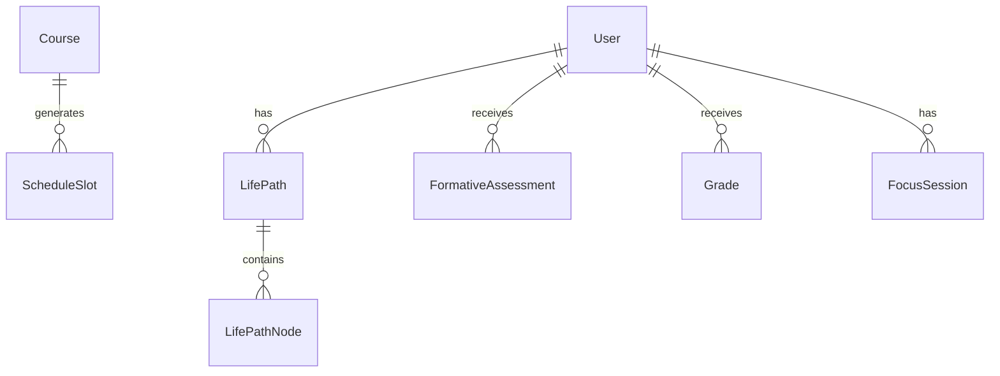

# 统一数据模型（Data Model）

> 🔑 **所有模块对接的基石**。本文件是数据结构的**唯一权威**，机器可读版本沉淀在 `packages/contracts/`。任何模块需要新字段，应先改这里，再同步到 API 与各端。

---

## 1. 命名与 ID 约定

- 所有实体用 `id`（UUID v4 字符串）。
- 时间戳统一为 **ISO 8601**（`"2026-09-01T08:00:00+08:00"`），带时区。
- 枚举值统一小写 `snake_case`。
- 所有实体都含审计字段：`created_at`、`updated_at`。

---

## 2. 核心对象

### 2.1 `User` 用户

```jsonc
{
  "id": "uuid",
  "name": "张三",
  "grade": 10,                 // 年级
  "interests": ["cs", "math", "art"],   // 兴趣板块 slug
  "created_at": "…", "updated_at": "…"
}
```

### 2.2 `LifePath` 人生路径（产品灵魂）

人生路径由一系列**节点(node)**组成，节点之间可层级嵌套。

```jsonc
{
  "id": "uuid",
  "user_id": "uuid",
  "title": "我的高中三年",
  "nodes": [ /* LifePathNode[] */ ],
  "status": "active",
  "created_at": "…", "updated_at": "…"
}
```

### 2.3 `LifePathNode` 路径节点

```jsonc
{
  "id": "uuid",
  "parent_id": null,           // 父节点（可形成树/分层）
  "type": "vision | long_term_goal | short_term_goal | task | interest | note",
  "title": "想研究人工智能",
  "description": "对 AI 的方向有兴趣",
  "status": "in_progress | achieved | pending | abandoned",
  // pending = 待定（允许任意位置待定）
  "start_at": "…", "due_at": "…", "completed_at": null,
  "order": 0,
  "source": "user | ai_suggest",   // 来源于用户沉淀 还是 AI 建议
  "ai_note": null,             // AI 补充说明（仅参考）
  "created_at": "…", "updated_at": "…"
}
```

> ⚠️ **关键**：`source: "ai_suggest"` 的节点必须是"建议稿"，只有用户确认后才转为 `user`；AI **永不**直接改变节点 `status`。

### 2.4 `Course` 课程 / 课表条目

```jsonc
{
  "id": "uuid",
  "source": "cloud | managebac | manual",
  "external_id": "来源系统ID",
  "name": "数学",
  "teacher": "王老师",
  "room": "A-301",
  "day_of_week": 1,            // 1-7
  "start_time": "08:00",
  "end_time": "08:45",
  "week_parity": "all | odd | even",
  "term": "2026-Fall",
  "category": "required | elective | club | self_study"
}
```

### 2.5 `ScheduleSlot` 时段（用于日程与专注）

```jsonc
{
  "id": "uuid",
  "date": "2026-09-01",
  "start_at": "2026-09-01T08:00:00+08:00",
  "end_at": "2026-09-01T08:45:00+08:00",
  "course_id": "uuid",          // 可选
  "title": "数学",
  "kind": "class | study | break | focus",
  "source": "schedule | focus"
}
```

### 2.6 `FormativeAssessment` 过程性评价

```jsonc
{
  "id": "uuid",
  "user_id": "uuid",
  "course_id": "uuid",
  "dimension": "participation | homework | quiz | project | conduct",
  "grade_level": "excellent | good | pass | needs_improvement",
  "comment": "课堂积极，合作佳",
  "assessed_at": "…",
  "source": "cloud | managebac"
}
```

### 2.7 `Grade` 成绩

```jsonc
{
  "id": "uuid",
  "user_id": "uuid",
  "course_id": "uuid",
  "exam_name": "期中考试",
  "score": 92,                  // 或等级
  "score_type": "score | level",
  "max_score": 100,
  "weight": 0.3,
  "exam_date": "2026-10-15",
  "source": "cloud | managebac"
}
```

### 2.8 `FocusSession` 专注会话

```jsonc
{
  "id": "uuid",
  "user_id": "uuid",
  "slot_id": "uuid",
  "started_at": "…", "ended_at": null,
  "planned_duration_min": 45,
  "actual_duration_min": 38,
  "status": "planned | running | completed | aborted"
}
```

---

## 3. 对象关系图（Mermaid）



---

## 4. 变更与演进规则

1. **向后兼容**：新增字段必须可选；删除/改名需先废弃（deprecate）再移除。
2. **版本化**：重大变更时提升 `contracts` 版本，并在 `docs/` 记录迁移说明。
3. **校验**：`packages/contracts` 提供 JSON Schema，各端做校验。
4. **同步机制**：数据接入产生的新数据走 `docs/events.md` 的 `data.synced` 事件，由 `apps/api` 统一落库并分发给客户端（增量/订阅）。更多细节见各模块文档。
